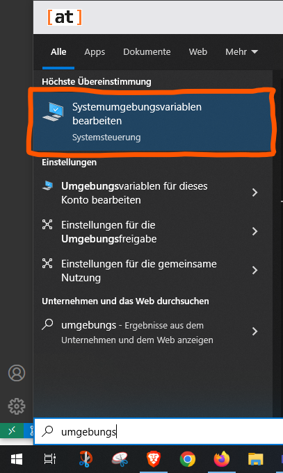
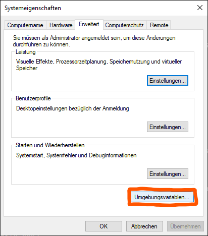
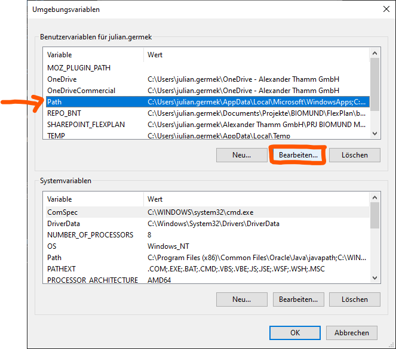
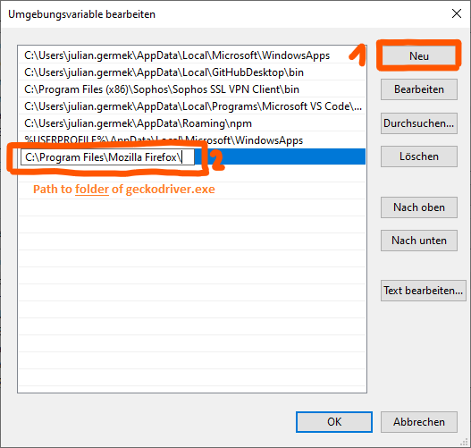
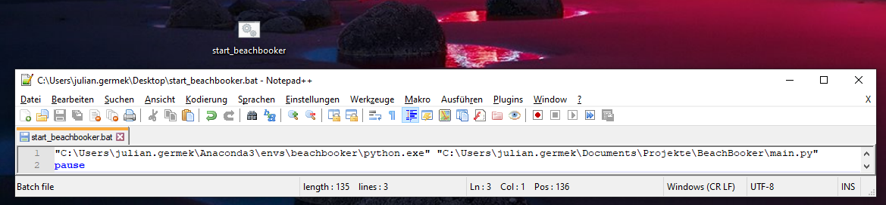
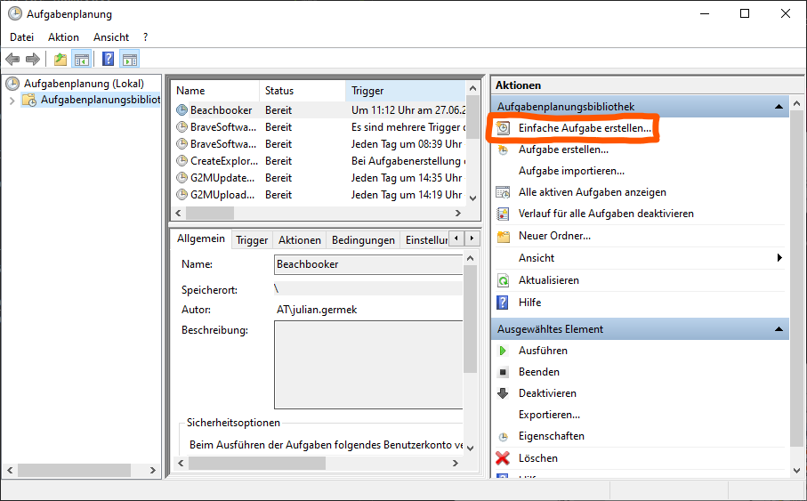
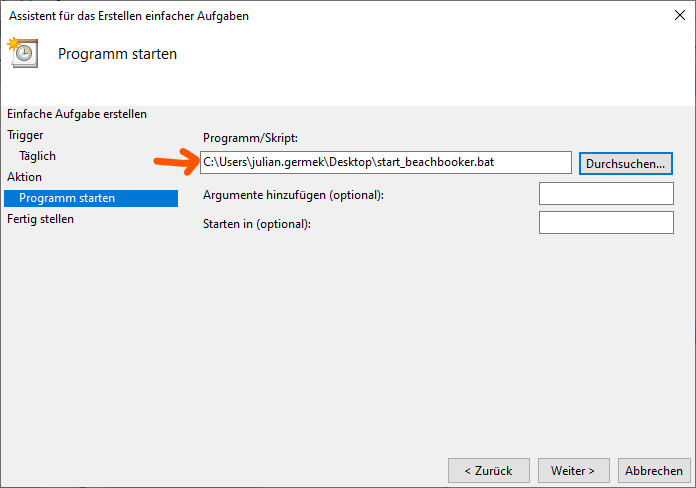
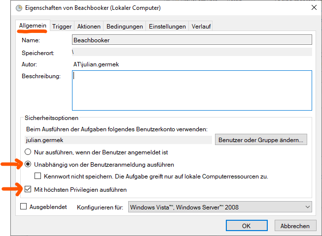
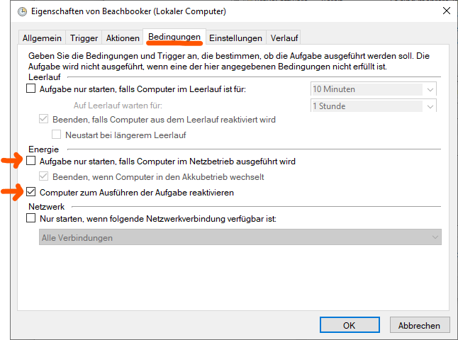

# build the image

docker build -t seblum/slotbooker:v1 .

# makefile add install of chromedriver

# Before you start
## Add crendentials of ZHS account
In the root directory, create a file "userdata.py" with two variables as follows:
```
username = "<yourusername>"
userpassword = "<yourpassword>"
```
## Make browser driver available
(Tested in Windows; might differ for other systems)

The script relies on starting a browser; currently Firefox. In order for the script to be able to start Firefox, it needs to know the location of the driver.
- Download latest version of the Firefox driver (geckodriver) from: https://github.com/mozilla/geckodriver/releases
- Save geckodriver.exe to a folder of your choice and add this folder to the Path variable:






# Setup automated runs
## Create Batch File to Run the Python Script
A .bat file can be used to open a command line and run the python script.

- Open a text editor, insert the following and replace placeholders with your paths:
```
"<Path where your Python exe is stored\python.exe>" "<Path where your Python script is stored\script name.py>"
pause
```
Notes: Quotes need to be included; _pause_ does not close the command window automatically after the script is finished so that the output can be read.

- Save the file as a .bat file.



A double klick on the bat file should open a command line and start the script.

## Create a task to run .bat file automatically
### Setup
(Tested in Windows; might differ for other systems)
- Start the windows app "Aufgabenplanung"
- Create basic task

- Setup details through wizard; Choose your .bat file as the program to start

- Find the created task in the list and open its settings (double click)
- Depending on your use case, consider these deviations from the default settings:


### Test
- Right click> Ausführen let's you run the task without waiting for the trigger

